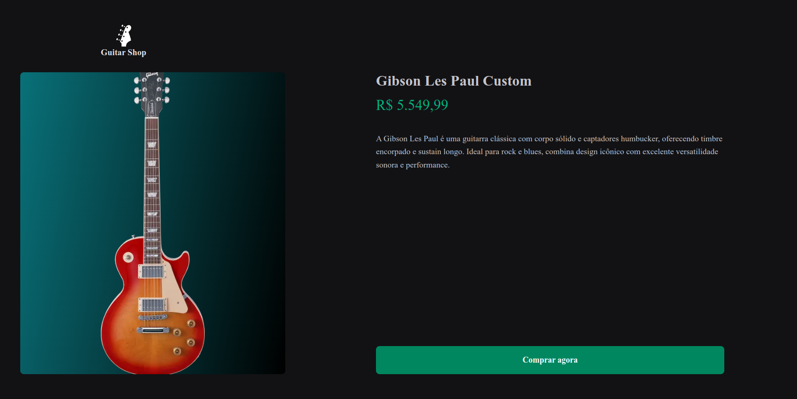
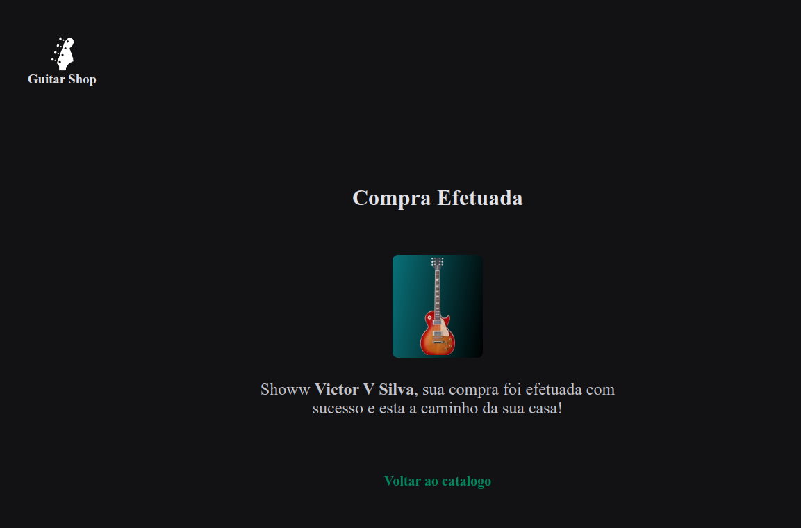

# Loja de Guitarras

Repositório de uma loja de guitarras desenvolvida com Next.js. Esta aplicação demonstra a integração com o Stripe para processamento de pagamentos, além de utilizar Axios para fazer requisições HTTP e as API Routes do Next.js para comunicação com o servidor.

## Tecnologias Utilizadas

- **Next.js**: Framework React para SSR, SSG e SPA.
- **Stripe**: Plataforma de pagamentos para aceitar e processar pagamentos online.
- **Axios**: Biblioteca para requisições HTTP.
- **Stitches**: Biblioteca de estilização CSS-in-js.
- **API Routes do Next.js**: Para comunicação backend e integração com o Stripe.

## Funcionalidades

- **Renderização Estática (SSG)**: Páginas de lista de guitarras geradas no momento do build.
- **Renderização Server-Side (SSR)**: Detalhes de produtos são gerados dinamicamente a cada requisição.
- **SPA (Single Page Application)**: Navegação fluida entre as páginas da loja.
- **Integração com Stripe**: Permite adicionar produtos ao carrinho e realizar o checkout.
- **Axios**: Utilizado para fazer requisições para a API e o Stripe.
- **API Routes do Next.js**: Gerencia o checkout e interage com o Stripe.

## Instalação e Execução

### Pré-requisitos

- Node.js >= v20.11.1
- Conta Stripe
- Chave de API do Stripe
- Cadastrar os produtos no stripe (imagem, nome, descrição e preço)

### Passos

1. Clone o repositório:

   ```bash
      git clone https://github.com/victor-vitalino/NextJs-store-with-Stripe.git
      cd NextJs-store-with-Stripe

   ```

2. Instale as dependencias

   ```bash
      yarn install
      # ou
      npm install
   ```

3. Crie um arquivo .env na raiz do projeto e adicione suas chaves de API do Stripe:
   ```bash
      STRIPE_SECRET_KEY=sk_test*...
      STRIPE_PUBLIC_KEY=pk_test*...
   ```
4. Inicie o servidor de desenvolvimento:

   ```bash
      yarn dev
      # ou
      npm run dev

   ```

5. Acesse a aplicação em http://localhost:3000.

## Estrutura de Pastas

```bash
├── pages
│   ├── api
│   │   └── checkout.ts # API Route para lidar com o checkout no Stripe
│   ├── product
│   │   └── [id].tsx    # Página de detalhes do produto usando SSG
│   ├── index.tsx       # Página inicial com lista de guitarras usando SSG
├── lib
│   └── stripe.ts       # Configuração do Stripe
├── components
│   └── Header/index.tsx  # Componente para exibir o header da aplicação
│   └── Header/styles.ts  # Estilização do header da aplicação
├── styles
│   └── stripe.ts        # Configuração do Stripe
├── public
│   ├── pages      # Pasta com estilos das paginas da aplicação
│   │      └── product.ts
│   │      └── sucess.ts
│   ├── pages      # Pasta com estilos das paginas da aplicação
│   └── global.ts      # configuração do de estilos globais com stitches
│   └── index.ts      # configuração de cores e fontes
└── .env           # Variáveis de ambiente


```

## Prints

1. Home
   <br />
   
   <br />

2. Product Detail
   <br />
   
   <br />

3. Checkout Form
   <br />
   
   <br />

4. Checkout Success
   <br />
   
   <br/>

5. Success Page
   <br />
   
   <br/>
